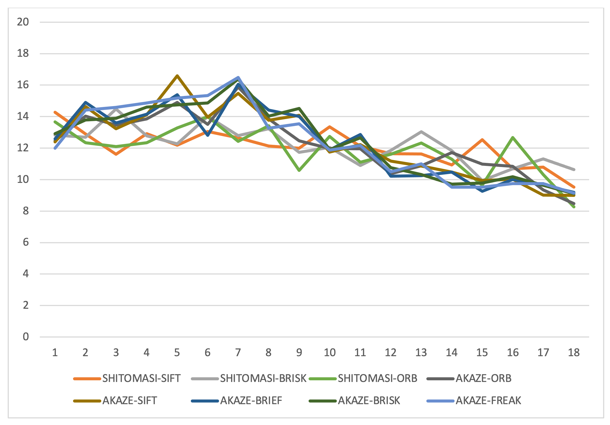

# SFND 3D Object Tracking - Final project

This repository contains the submission for the final "Camera class" project related to "Tracking an object in 3D space", which is part of Udacity's Sensor Fusion Nanodegree program.

To obtain the starter code, read about dependencies and/or basic build instructions, please refer to the following repository:
https://github.com/udacity/SFND_3D_Object_Tracking.git

## Report

---

#### Task FP.0 Final Report
> Provide a Writeup / README that includes all the rubric points and how you addressed each one. You can submit your writeup as markdown or pdf.

This README is created to meet this specification.

---

#### Task FP.1 Match 3D Objects
> Implement the method "matchBoundingBoxes", which takes as input both the previous and the current data frames and provides as output the ids of the matched regions of interest (i.e. the boxID property). Matches must be the ones with the highest number of keypoint correspondences.

```c++
void matchBoundingBoxes(std::vector<cv::DMatch> &matches,
                        std::map<int, int> &bbBestMatches, DataFrame &prevFrame,
                        DataFrame &currFrame) {

  int p = prevFrame.boundingBoxes.size();
  int c = currFrame.boundingBoxes.size();
  int countMatches[p][c] = {};

  // loop across all keypoint matches
  for (cv::DMatch match : matches) {

    bool prevBB_found = false;
    bool currBB_found = false;
    std::vector<int> prevBB_idx, currBB_idx;

    // find bounding boxes in previous frame that contain the matched keypoint
    for (int i = 0; i < p; i++) {

      if (prevFrame.boundingBoxes[i].roi.contains(prevFrame.keypoints[match.queryIdx].pt)) {

        prevBB_found = true;
        prevBB_idx.push_back(i);
      }
    }

    // find bounding boxes in current frame that contain the matched keypoint
    for (int i = 0; i < c; i++) {

      if (currFrame.boundingBoxes[i].roi.contains(currFrame.keypoints[match.trainIdx].pt)) {

        currBB_found = true;
        currBB_idx.push_back(i);
      }
    }

    // increment counters for all possible bounding box mathches that the
    // current matched keypoint could imply
    if (prevBB_found && currBB_found) {

      for (auto itr_c : currBB_idx) {

        for (auto itr_p : prevBB_idx) {
          
          countMatches[itr_p][itr_c] += 1;
        }
      }
    }

    // for each bounding box in the previous frame, find the current frame
    // bounding box that matches according to the most keypoint matches
    for (int i = 0; i < p; i++) {

      int max_count = 0;
      int max_idc = 0;
      for (int j = 0; j < c; j++) {

        if (countMatches[i][j] > max_count) {
          
          max_count = countMatches[i][j];
          max_idc = j;
        }
      }
      bbBestMatches[i] = max_idc;
    }
  }
}
```

---

#### Task FP.2 Compute Lidar-based TTC
> Compute the time-to-collision in second for all matched 3D objects using only Lidar measurements from the matched bounding boxes between current and previous frame.

```c++
void computeTTCLidar(std::vector<LidarPoint> &lidarPointsPrev,
                     std::vector<LidarPoint> &lidarPointsCurr, double frameRate,
                     double &TTC) {

  auto compareLidarPoints = [](LidarPoint lp1, LidarPoint lp2) {
    return (lp1.x < lp2.x);
  };

  double dT = 1 / frameRate;
  std::sort(lidarPointsPrev.begin(), lidarPointsPrev.end(), compareLidarPoints);
  std::sort(lidarPointsCurr.begin(), lidarPointsCurr.end(), compareLidarPoints);

  // select 10% of lidar points with closest distance (at least 1)
  int nPrev = lidarPointsPrev.size() < 10 ? 1 : lidarPointsPrev.size() / 10;
  int nCurr = lidarPointsCurr.size() < 10 ? 1 : lidarPointsCurr.size() / 10;

  // find median distance of selected lidar points
  double d_prev = (lidarPointsPrev[std::ceil(nPrev / 2. - 1)].x +
                   lidarPointsPrev[std::floor(nPrev / 2.)].x) /
                  2.0;
  double d_curr = (lidarPointsCurr[std::ceil(nCurr / 2. - 1)].x +
                   lidarPointsCurr[std::floor(nCurr / 2.)].x) /
                  2.0;

  TTC = (d_curr * dT) / (d_prev - d_curr);
}
```
#### Task FP.3 Associate Keypoint Correspondences with Bounding Boxes
> Prepare the TTC computation based on camera measurements by associating keypoint correspondences to the bounding boxes which enclose them. All matches which satisfy this condition must be added to a vector in the respective bounding box.

```c++
void clusterKptMatchesWithROI(BoundingBox &boundingBox,
                              std::vector<cv::KeyPoint> &kptsPrev,
                              std::vector<cv::KeyPoint> &kptsCurr,
                              std::vector<cv::DMatch> &kptMatches) {

  // find matches belonging to boundingbox and calculate euclidian distances
  vector<double> euclDistances;
  for (cv::DMatch match : kptMatches) {

    if (boundingBox.roi.contains(kptsCurr[match.trainIdx].pt)) {

      boundingBox.keypoints.push_back(kptsCurr[match.trainIdx]);
      boundingBox.kptMatches.push_back(match);
      double euclDist =
          cv::norm(kptsPrev[match.queryIdx].pt - kptsCurr[match.trainIdx].pt);
      euclDistances.push_back(euclDist);
    }
  }

  // calculate median euclidian distance
  int n = euclDistances.size();
  std::sort(euclDistances.begin(), euclDistances.end());
  double medianEuclDist = (euclDistances[std::ceil(n / 2. - 1)] +
                           euclDistances[std::floor(n / 2.)]) /
                          2.0;

  // filter out matches with sufficiently small deviation to the median euclidian distance
  vector<cv::KeyPoint> kpts;
  vector<cv::DMatch> matches;
  for (cv::DMatch match : boundingBox.kptMatches) {

    double euclDist =
        cv::norm(kptsPrev[match.queryIdx].pt - kptsCurr[match.trainIdx].pt);
    if (abs(euclDist - medianEuclDist) <= 25) {
      matches.push_back(match);
      kpts.push_back(kptsCurr[match.trainIdx]);
    }
  }
  boundingBox.keypoints = kpts;
  boundingBox.kptMatches = matches;  
}
```

---
#### Task FP.4 Compute Camera-based TTC
> Compute the time-to-collision in second for all matched 3D objects using only keypoint correspondences from the matched bounding boxes between current and previous frame.

```c++
void computeTTCCamera(std::vector<cv::KeyPoint> &kptsPrev,
                      std::vector<cv::KeyPoint> &kptsCurr,
                      std::vector<cv::DMatch> kptMatches, double frameRate,
                      double &TTC, cv::Mat *visImg) {

  vector<double> distRatios;

  for (auto it1 = kptMatches.begin(); it1 != kptMatches.end() - 1; ++it1) {

    // get current keypoint and its matched partner in the prev. frame
    cv::KeyPoint kpOuterCurr = kptsCurr.at(it1->trainIdx);
    cv::KeyPoint kpOuterPrev = kptsPrev.at(it1->queryIdx);

    for (auto it2 = kptMatches.begin() + 1; it2 != kptMatches.end(); ++it2) {

      double minDist = 100.0; // min. required distance

      // get next keypoint and its matched partner in the prev. frame
      cv::KeyPoint kpInnerCurr = kptsCurr.at(it2->trainIdx);
      cv::KeyPoint kpInnerPrev = kptsPrev.at(it2->queryIdx);

      // compute distances and distance ratios
      double distCurr = cv::norm(kpOuterCurr.pt - kpInnerCurr.pt);
      double distPrev = cv::norm(kpOuterPrev.pt - kpInnerPrev.pt);

      if (distPrev > std::numeric_limits<double>::epsilon() &&
          distCurr >= minDist) {

        double distRatio = distCurr / distPrev;
        distRatios.push_back(distRatio);
      }
    }
  }

  // only continue if list of distance ratios is not empty
  if (distRatios.size() == 0) {

    TTC = NAN;
    return;
  }

  // compute camera-based TTC from distance ratios
  double dT = 1 / frameRate;
  std::sort(distRatios.begin(), distRatios.end());
  double medianDistRatio = (distRatios[std::ceil(distRatios.size() / 2. - 1)] +
                            distRatios[std::floor(distRatios.size() / 2.)]) /
                           2.0;
  TTC = -dT / (1 - medianDistRatio);
}
```

---
#### Task FP.5 Performance Evaluation 1
> Find examples where the TTC estimate of the Lidar sensor does not seem plausible. Describe your observations and provide a sound argumentation why you think this happened.

| Picture | Explanation |
| ---- | ---- |
|  |  The picture shows which lidar points are consdered for distance measurement, red points are from prev frame and green from the current. In this example the lidar points considered switched from the rear bumper to the hatch|
|  |  Similar situation as previous, the considered lidar measurements have changed "focus" on the vehicle considerably|
|  |  The measurements at the license plate appear to be more noisy|

---
#### Task FP.6 Performance Evaluation 2
> Run several detector / descriptor combinations and look at the differences in TTC estimation. Find out which methods perform best and also include several examples where camera-based TTC estimation is way off. As with Lidar, describe your observations again and also look into potential reasons.

```
Below, a complete table is shown with calculated TTC's for all destector/descriptor combinations. Also, a graph is shown with only the most plausible results, showing that particularly the Shitomasi detector has performed well on the data.
```


|Det/des combination|2|3|4|5|6|7|8|9|10|11|12|13|14|15|16|17|18|19|
|---------------|-------|-------|--------|-------|-------|-------|-------|-------|-------|--------|-------|-------|-------|-------|--------|-------|-------|-------|
|SHITOMASI-BRISK|12.8228|12.6968|14.4793 |12.7779|12.2694|14.0207|12.7924|13.2285|11.7376|12.0439 |10.9042|11.8481|13.0323|11.8438|9.94433 |10.6857|11.3134|10.6426|
|SHITOMASI-BRIEF|14.2952|12.9876|10.1673 |11.5009|12.3552|13.6508|13.4924|12.5881|11.7069|13.4042 |11.4293|11.2447|12.4169|12.7067|11.9757 |12.1502|10.7263|8.38114|
|SHITOMASI-ORB  |13.6697|12.3332|12.1    |12.3378|13.2826|13.9909|12.4368|13.4207|10.5794|12.7353 |11.0976|11.6118|12.3243|11.2972|9.63708 |12.6787|10.321 |8.26497|
|SHITOMASI-FREAK|12.7196|13.0249|12.6506 |11.6697|12.3305|13.7533|13.5316|11.376 |12.3292|12.6285 |11.0809|12.7096|12.5595|12.1365|11.2932 |9.94887|11.3035|7.34604|
|SHITOMASI-SIFT |14.2804|12.9004|11.6087 |12.9209|12.1886|13.0553|12.6612|12.1376|11.9899|13.3599 |12.1076|11.6524|11.6227|10.9335|12.5287 |10.68  |10.7884|9.52513|
|HARRIS-BRISK   |10.9082|10.586 |26.2905 |11.7693|-inf   |12.9945|12.2792|12.9162|nan    |-inf    |11.2142|11.6948|25.6953|5.6061 |-13.6263|6.33866|12.5848|-inf   |
|HARRIS-BRIEF   |10.9082|10.586 |-10.8522|12.1284|34.1473|15.2483|12.3379|17.6204|3.30058|20.5862 |11.7414|nan    |568.322|5.6061 |-13.6263|6.45749|12.5848|-inf   |
|HARRIS-ORB     |10.9082|11.0081|-11.4731|11.7693|34.7543|13.5907|13.712 |17.6204|nan    |nan     |11.2142|11.1055|13.4095|5.85828|-12.639 |6.52962|12.5848|-inf   |
|HARRIS-FREAK   |9.74953|10.586 |nan     |12.629 |44.9166|nan    |12.2792|12.3725|nan    |10.2931 |23.627 |11.9536|nan    |nan    |-25.2781|8.86241|11.1009|nan    |
|HARRIS-SIFT    |10.9082|63.8475|-80.8525|11.5792|13.6432|27.8744|13.497 |17.6204|3.93864|-13.4405|11.4377|11.6948|13.4327|5.66097|-inf    |7.29175|12.5848|-inf   |
|FAST-BRISK     |12.1352|12.3453|13.6189 |12.8853|68.6242|13.4935|12.1368|11.5105|12.0205|13.6097 |12.5094|12.2816|12.2393|12.0961|11.1574 |12.305 |10.5959|12.1527|
|FAST-BRIEF     |10.8098|11.2618|12.9553 |13.3192|22.3797|13.2534|11.4717|11.0579|11.8969|13.3448 |13.7364|10.6507|11.4314|10.7624|11.3035 |11.9434|7.74364|11.6071|
|FAST-ORB       |10.5   |12.5943|16.2001 |14.0316|15.2575|12.5645|11.2142|11.761 |11.5712|13.4637 |14.0149|13.6347|12.0133|11.3782|12.561  |11.6078|10.4317|10.9336|
|FAST-FREAK     |12.0855|12.8325|11.1471 |12.7922|8.91112|12.2957|11.6962|12.0122|12.5678|12.7001 |12.4645|12.7755|12.0746|12.0187|10.9736 |12.0946|10.7105|11.5312|
|FAST-SIFT      |11.428 |11.6674|14.0554 |14.745 |28.4716|13.2095|12.2695|12.6027|12.1408|13.8308 |14.3108|11.803 |12.5265|11.5341|11.4113 |11.2503|7.50634|10.822 |
|BRISK-BRISK    |11.9632|22.6413|14.5255 |16.3046|27.6679|14.6337|15.5437|18.0417|14.7708|12.4125 |12.0802|11.2959|12.6239|11.3519|13.3109 |11.0861|10.1494|12.3893|
|BRISK-BRIEF    |12.994 |13.0946|13.6711 |14.6078|13.5831|14.9177|13.4611|16.8297|15.2453|11.9153 |12.2422|12.7471|13.148 |10.3713|11.8821 |12.1509|8.76497|10.7774|
|BRISK-ORB      |12.404 |21.2701|15.9447 |15.1036|20.2973|32.9407|14.203 |14.5124|14.8543|11.6525 |11.5656|13.1406|10.769 |12.9851|12.1858 |11.6833|8.72506|12.3655|
|BRISK-FREAK    |13.2775|21.2582|12.8237 |15.0627|30.7601|14.8626|17.0509|16.1681|15.7997|12.5076 |12.6479|12.2816|11.8439|11.5114|13.622  |10.2978|9.73502|9.90522|
|BRISK-SIFT     |12.9834|16.508 |16.7055 |13.1981|26.358 |13.9287|14.403 |16.15  |17.6798|15.2121 |14.8177|11.7122|13.0199|10.7272|14.2108 |10.8982|10.2467|11.9679|
|ORB-BRISK      |19.4668|13.599 |12.0855 |20.001 |538.829|10.8334|12.8717|10.6521|13.1221|14.7536 |7.78781|52.7806|11.6895|9.48525|8.72363 |11.4315|17.2956|25.6678|
|ORB-BRIEF      |13.0822|13.3982|28.2302 |22.1695|46.4846|9.19978|10.3581|-inf   |140.565|9.43013 |19.4803|12.7414|15.9498|13.145 |13.1413 |10.6994|16.7035|14.4987|
|ORB-ORB        |15.0326|11.6187|26.0815 |35.3418|29.0177|-inf   |-inf   |9.18716|-inf   |15.2808 |9.19185|-inf   |13.0111|11.4024|25.0247 |16.6123|18.3228|36.3076|
|ORB-FREAK      |12.0569|12.2395|11.0246 |10.781 |-inf   |11.1136|-inf   |8.95665|13.47  |-inf    |5.96008|14.9136|6.3262 |54.268 |8.68208 |5.84354|11.3219|4.71741|
|ORB-SIFT       |14.8587|11.2451|12.3578 |-inf   |520.246|24.7222|-inf   |10.4477|13.8513|11.1389 |10.1214|-inf   |7.94456|13.7643|13.6989 |8.6586 |18.3228|9.45581|
|AKAZE-BRISK    |12.9115|13.7943|13.8888 |14.6115|14.7461|14.8704|16.3814|14.0328|14.5222|11.9035 |12.6523|10.7585|10.3211|9.70358|9.78819 |10.1785|9.63517|9.10765|
|AKAZE-BRIEF    |12.5832|14.8953|13.5944 |14.1513|15.383 |12.8068|16.0513|14.4213|14.006 |11.8933 |12.8704|10.2251|10.2528|10.4786|9.25157 |10.0024|9.63699|9.18684|
|AKAZE-ORB      |12.4673|14.0347|13.4586 |13.8561|14.8955|13.5111|15.8707|13.8598|12.4621|11.9817 |11.9622|10.3747|10.876 |11.7082|10.9827 |10.8492|9.34065|8.47622|
|AKAZE-FREAK    |11.9982|14.4177|14.589  |14.8625|15.1838|15.3406|16.4933|13.2656|13.5469|11.8786 |12.1624|10.5013|10.9929|9.52434|9.51807 |9.73936|9.73913|9.13404|
|AKAZE-SIFT     |12.3917|14.646 |13.2294 |14.1141|16.598 |13.9616|15.4755|13.7661|14.0783|11.7553 |12.2205|11.1784|10.8611|10.4743|9.94151 |10.0291|9.02048|8.9967 |
|SIFT-BRISK     |11.7937|13.6957|13.6748 |20.5567|15.5412|9.94747|15.7147|15.2154|13.1373|11.3858 |12.9654|10.3338|10.0226|9.17013|9.42478 |9.0902 |9.46449|9.36821|
|SIFT-BRIEF     |12.0024|14.8373|15.3641 |24.2442|15.0724|12.6016|14.9097|15.8067|12.1098|11.2532 |11.9292|11.433 |9.28732|10.2186|9.28972 |8.65332|8.96261|9.4282 |
|SIFT-FREAK     |12.4585|12.9049|14.2104 |18.4799|15.7341|11.7209|14.8627|14.4876|13.2743|11.4383 |14.167 |10.6798|9.29214|10.9614|9.46445 |8.5209 |9.47992|11.6288|
|SIFT-SIFT      |11.3868|12.5726|12.9422 |18.8184|12.4784|11.2969|13.5735|14.6937|12.9662|10.5698 |11.2887|11.0189|9.24828|10.5754|9.77464 |9.05267|8.69186|9.01264|

---